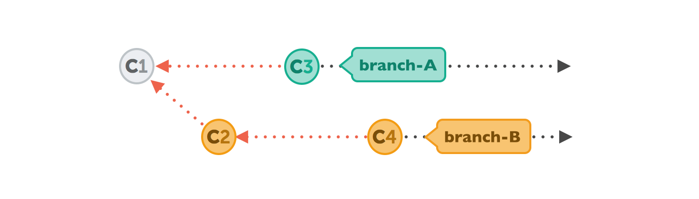
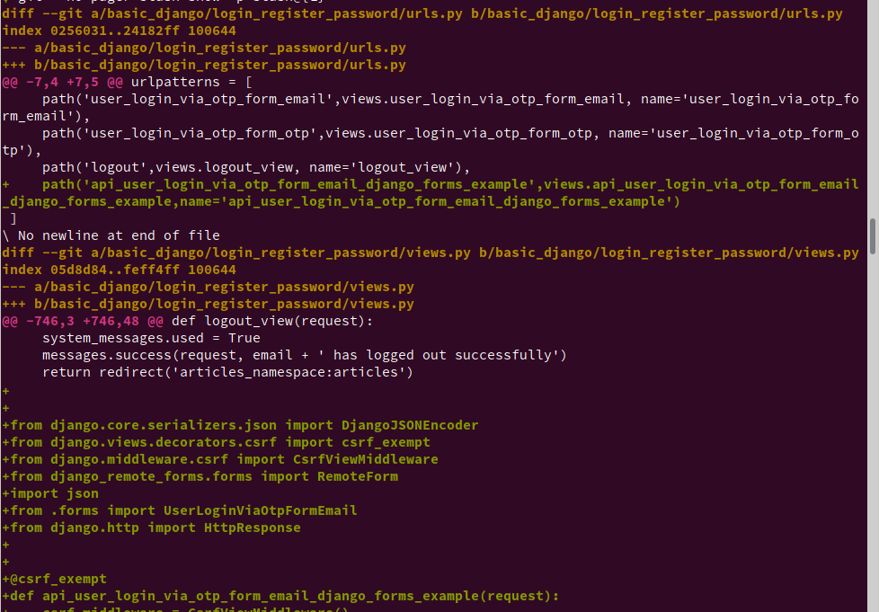

   * [1.Head](#1head)
   * [2.Git caret and tilde HEAD~ and HEAD^ ](#2git-caret-and-tilde-head-and-head-)
      * [HEAD@{}](#head)
   * [git commit --amend:: Changing the Last/previous Commit git commit --amend: git commit --amend](#git-commit---amend-changing-the-lastprevious-commit-git-commit---amend-git-commit---amend)
   * [3.Checkout: Understanding how "checkout" works](#3checkout-understanding-how-checkout-works)
   * [4.What's a "detached HEAD"](#4whats-a-detached-head)
      * [The problem with a detached HEAD](#the-problem-with-a-detached-head)
   * [5.Merge Commit or Rebase](#5merge-commit-or-rebase)
      * [Human Commits &amp; Merge Commits](#human-commits--merge-commits)
      * [Normally, a commit is carefully created by a human being. It's a meaningful unit that wraps only related changes and annotates them with a comment.](#normally-a-commit-is-carefully-created-by-a-human-being-its-a-meaningful-unit-that-wraps-only-related-changes-and-annotates-them-with-a-comment)
      * [A merge commit is a bit different: instead of being created by a developer, it gets created automatically by Git. And instead of wrapping a set of related changes, its purpose is to connect two branches, just like a knot. If you want to understand a merge operation later, you need to take a look at the history of both branches and the corresponding commit graph.](#a-merge-commit-is-a-bit-different-instead-of-being-created-by-a-developer-it-gets-created-automaticallyby-git-and-instead-of-wrapping-a-set-of-related-changes-its-purpose-is-to-connect-two-branches-just-like-a-knot-if-you-want-to-understand-a-merge-operation-later-you-need-to-take-a-look-at-the-history-of-bothbranches-and-the-corresponding-commit-graph)
      * [Integrating with Rebase](#integrating-with-rebase)
      * [The Pitfalls of Rebase](#the-pitfalls-of-rebase)
   * [6.Git log, Branch and checkout](#6git-log-branch-and-checkout)
      * [Creating a New Branch](#creating-a-new-branch)
      * [Switching Branches](#switching-branches)
   * [7.fixing up mistakes](#7fixing-up-mistakes)
   * [8.Git revert vs reset](#8git-revert-vs-reset)
   * [9.Git revert](#9git-revert)
      * [Advantage of revert](#advantage-of-revert)
   * [10.Resetting, Checking Out &amp; Reverting](#10resetting-checking-out--reverting)
   * [11.Git reset](#11git-reset)
      * [Reset A Specific Commit](#reset-a-specific-commit)
   * [12.Checkout old commits](#12checkoutold-commits)
   * [This is useful for quickly inspecting an old version of your project. However, since there is no branch reference to the current HEAD, this puts you in a detached HEAD state. This can be dangerous if you start adding new commits because there will be no way to get back to them after you switch to another branch. ](#this-is-useful-for-quickly-inspecting-an-old-version-of-your-project-however-since-there-is-no-branch-reference-to-the-current-head-this-puts-you-in-a-detached-headstate-this-can-be-dangerous-if-you-start-adding-new-commits-because-there-will-be-no-way-to-get-back-to-them-after-you-switch-to-another-branch-)
   * [For this reason, you should always create a new branch before adding commits to a detached HEAD.](#for-this-reason-you-should-always-create-a-new-branch-before-adding-commits-to-a-detached-head)
   * [13.Git lost and found](#13git-lost-and-found)
   * [14.In git, what is the difference between a dangling commit and a dangling blob?](#14in-git-what-is-the-difference-between-a-dangling-commit-and-a-dangling-blob)
   * [15.How do I prevent git diff from using a pager?](#15how-do-i-prevent-git-diff-from-using-a-pager)
   * [16.Git reset: When I forgot to do some changes and I push changes to remote, then how to incorporate that change and resend the push](#16git-reset-when-i-forgot-to-do-some-changes-and-i-push-changes-to-remote-then-how-to-incorporate-that-change-and-resend-the-push)
   * [](#-1)
   * [](#-2)
   * [Changing the Last Commit](#changing-the-last-commit)
      * [simply change the commit message](#simply-change-the-commit-message)
      * [change the actual content of your last commit](#change-the-actual-contentof-your-last-commit)
   * [How to change the git rebase editor to sublime text:](#how-to-change-the-git-rebase-editor-to-sublime-text)
   * [17.Git rebase:: Changing Multiple Commit Messages](#17git-rebase-changing-multiple-commit-messages)
      * [interactive rebase tool](#interactive-rebase-tool)
      * [Running this command gives you a list of commits in your text editor that looks something like this:](#running-this-command-gives-you-a-list-of-commits-in-your-text-editor-that-looks-something-like-this)
      * [These instructions tell you exactly what to do. Type](#these-instructions-tell-you-exactly-what-to-do-type)
      * [Change the commit message, and exit the editor. Then, run](#change-the-commit-message-and-exit-the-editor-then-run)
      * [Reordering Commits](#reordering-commits)
      * [Squashing Commits](#squashing-commits)
   * [Git log --all](#git-log---all)
   * [Changing/Amend root commit](#changingamend-root-commit)
      * [**** How do I exit the editor without committing anything? Exit Vim without committing changes in Git](#-how-do-i-exit-the-editor-without-committing-anything-exit-vim-without-committing-changes-in-git)
   * [AMENDIND MULTIPLE COMMITS USING REBASE FROM ROOT AND USING STASH](#amendind-multiple-commits-using-rebase-from-root-and-using-stash)
   * [18.Git reset vs Git checkout](#18git-reset-vs-git-checkout)
   * [19.git understanding staging index and git reset](#19git-understanding-staging-index-and-git-reset)
   * [20.see the files changed in a particular commit](#20see-the-files-changed-in-a-particular-commit)
   * [21.Copying a git commit to a new folder](#21copying-a-git-commit-to-a-new-folder)
   * [22.Revert back from github](#22revert-back-from-github)
   * [How to get the project from git and start fresh](#how-to-get-the-project-from-git-and-start-fresh)
   * [](#-3)
   * [23.Remove a file back till first commit](#23remove-a-file-back-till-first-commit)
   * [24.Merge conflicts while rebasing and changing file in previous commit](#24merge-conflicts-while-rebasing-and-changing-file-in-previous-commit)
   * [25.How to commit only a message to GIT?](#25how-to-commit-only-a-message-to-git)
   * [Git branching](#git-branching)
      * [Basic Merge Conflicts](#basic-merge-conflicts)
      * [Branch Management](#branch-management)
         * [Get List of Branches and the current branch](#get-list-of-branches-and-the-current-branch)
         * [To see the last commit on each branch, you can run git branch -v:](#to-see-the-last-commit-on-each-branch-you-can-run-git-branch--v)
      * [changes in working directory and changes staged in index do not belong to a branch.](#changes-in-working-directory-and-changes-staged-in-index-do-not-belong-to-a-branch)
      * [git stash --all ](#git-stash---all-)
      * [[image] Git stash typical usage](#image-git-stash-typical-usage)
      * [How to take a back up of the current code in a new branch](#how-to-take-a-back-up-of-the-current-code-in-a-new-branch)
      * [How to push a branch to github](#how-to-push-a-branch-to-github)
      * [How git will handle the working tree (unstaged and untracked) files when doing checkout](#how-git-will-handle-the-working-tree-unstaged-and-untracked-files-when-doing-checkout)
   * [How to: Colours in Git](#how-to-colours-in-git)
   * [Git add custom commands in gitconfig:](#git-add-custom-commands-in-gitconfig)
* # 1.Head

     * HEAD is a reference to the last commit in the currently check-out branch. You can think of theHEAD as the "current branch". When you switch branches with git checkout, the HEAD revision changes to point to the tip of the new branch.

* # 2.Git caret and tilde HEAD\~ and HEAD^ 

     * ref\~ is shorthand for ref\~1 and means the commit's first parent. ref\~2 means the commit's first parent's first parent. ref\~3 means the commit's first parent's first parent's first parent. And so on.

     * ref^ is shorthand for ref^1 and means the commit's first parent. But where the two differ is that ref^2 means the commit's second parent(remember, commits can have two parents when they are a merge).

     * The ^ and \~ operators can be combined.

     * Here's a diagram showing how to reference various commits using HEAD as the starting point.

     *         

     *         

     * \*\*\*\*\*\*\*\*\*\*\*\*

     * HEAD\~ is shorthand for HEAD\~1, but here this means the first ancestor of HEAD – HEAD\~2 is not the second parent of HEAD but the grandparent of HEAD:

     * \*\*\*\*\*\*\*\*\*\*\*\*\*\*

     * 

     * \*\*\*\*\*\*\*\*\*\*\*\*\*\*  https://stackoverflow.com/a/29120883/2897115

     * 

     * \*\*\*\*\*\*\*\*\*\*\*\*\*\*\* https://stackoverflow.com/a/48465635/2897115

     * \~ is what you want most of the time, it references past commits to the current branch

     * ^ references parents (git-merge creates a 2nd parent or more)

     * A\~ is always the same as A^ 

     * A\~\~ is always the same as A^^, and so on 

     * A\~2 is not the same as A^2 however, 

     * because \~2 is shorthand for \~\~ 

     * while ^2 is not shorthand for anything, it means the 2nd parent

     * \*\*\*\*\*\*\*\*\*\*\*\*\*\*\*\*

     * way to remember: '\~' is "fuzzy" or "approximate" (i.e., you only get the first parent) while '^' is precise (so goes through every single commit).

     * \*\*\*\*\*\*\*\*\*\*\*\*

 * ## HEAD@{}

     * It is worth noting that git also has a syntax for tracking "from-where-you-came"/"want-to-go-back-now" - for example, HEAD@{1} will reference the place from where you jumped to new commit location.

     * Basically HEAD@{} variables capture the history of HEAD movement, and you can decide to use a particular head by looking into reflogs of git using the command git reflog.

     * Example:

     * 0aee51f HEAD@{0}: reset: moving to HEAD@{5} 290e035 HEAD@{1}: reset: moving to HEAD@{7} 

     * 0aee51f HEAD@{2}: reset: moving to HEAD@{3} 290e035 HEAD@{3}: reset: moving to HEAD@{3} 

     * 9e77426 HEAD@{4}: reset: moving to HEAD@{3} 290e035 HEAD@{5}: reset: moving to HEAD@{3} 

     * 0aee51f HEAD@{6}: reset: moving to HEAD@{3} 290e035 HEAD@{7}: reset: moving to HEAD@{3} 

     * 9e77426 HEAD@{8}: reset: moving to HEAD@{3} 290e035 HEAD@{9}: reset: moving to HEAD@{1} 

     * 0aee51f HEAD@{10}: reset: moving to HEAD@{4} 290e035 HEAD@{11}: reset: moving to HEAD^ 

     * 9e77426 HEAD@{12}: reset: moving to HEAD^ eb48179 HEAD@{13}: reset: moving to HEAD\~ 

     * f916d93 HEAD@{14}: reset: moving to HEAD\~ 0aee51f HEAD@{15}: reset: moving to HEAD@{5} 

     * f19fd9b HEAD@{16}: reset: moving to HEAD\~1 290e035 HEAD@{17}: reset: moving to HEAD\~2 

     * eb48179 HEAD@{18}: reset: moving to HEAD\~2 0aee51f HEAD@{19}: reset: moving to HEAD@{5} 

     * eb48179 HEAD@{20}: reset: moving to HEAD\~2 0aee51f HEAD@{21}: reset: moving to HEAD@{1} 

     * f916d93 HEAD@{22}: reset: moving to HEAD@{1} 0aee51f HEAD@{23}: reset: moving to 

     * HEAD@{1} f916d93 HEAD@{24}: reset: moving to HEAD^ 0aee51f HEAD@{25}: commit (amend): 3rd commmit 35a7332 HEAD@{26}: checkout: moving from temp2\_new\_br to temp2\_new\_br 

     * 35a7332 HEAD@{27}: commit (amend): 3rd commmit 72c0be8 HEAD@{28}: commit (amend): 3rd commmit

     * An example could be that I did local-commits a-\>b-\>c-\>d and then I went back discarding 2 commits to check my code - git reset HEAD\~2 - and then after that I want to move my HEAD back to d - git reset HEAD@{1}.

* # git commit --amend:: Changing the Last/previous Commit git commit --amend: git commit --amend

     * <table><colgroup><col style="width: 100%" /></colgroup><tbody><tr class="odd"><td>The git commit --amend command is a convenient way to modify the most recent commit.  *** It lets you combine staged changes with the previous commit instead of creating an entirely new commit.  Now lets suppose we want to remove a line from the previous commit. So we change the file (remove the desired line) and then   git add -A or git add file to stage the changes.   NOw using this staged changes we amend the previous commit  git commit --amend  (it opens vim then do :wq!)  Vi editor is opened so that you can change the commit message. But if you think you want to quit vim and still do some more changes in files then q! Will not work, it will create a commit. So to avoid that  in vim you can perform this with   :cq!  It can also be used to simply edit the previous commit message without changing its snapshot.   But, amending does not just alter the most recent commit, it replaces it entirely, meaning the amended commit will be a new entity with its own ref.  To Git, it will look like a brand new commit, which is visualized with an asterisk (*) in the diagram below.  # after amend check the status which files are modified git --no-pager show --stat  HOw to push:  Git push ( will not work ) $ git push    Enter passphrase for key '/home/simha/.ssh/id_rsa':  To github.com:sant527/django_basic_documentation.git  ! [rejected]        master -&gt; master (non-fast-forward) error: failed to push some refs to 'git@github.com:sant527/django_basic_documentation.git' hint: Updates were rejected because the tip of your current branch is behind hint: its remote counterpart. Integrate the remote changes (e.g. hint: 'git pull ...') before pushing again. hint: See the 'Note about fast-forwards' in 'git push --help' for details.   Solution: (https://stackoverflow.com/questions/39399804/updates-were-rejected-because-the-tip-of-your-current-branch-is-behind) git push -f  The -f is actually required because of the rebase. Whenever you do a rebase you would need to do a force push becasue the remote branch cannot be fast-forwarded to your commit. </td></tr></tbody></table>

     * 

* # 3.Checkout: Understanding how "checkout" works

     * With the "git checkout" command, you determine which revision of your project you want to work on. Git then places all of that revision's files in your working copy folder.

     * Normally, you use a branch name to communicate with "git checkout":

     * $ git checkout development

* # 4.What's a "detached HEAD"

     * However, you can also provide the SHA1 hash of a specific commit instead:

     * $ git checkout 56a4e5c08

     * Note: checking out '56a4e5c08'.

     * You are in 'detached HEAD' state...

     * This exact state - when a specific commit is checked out instead of a branch - is what's called a "detached HEAD".

     * 

 * ## The problem with a detached HEAD

     * The HEAD pointer in Git determines your current working revision (and thereby the files that are placed in your project's working directory). Normally, when checking out a proper branch name, Git automatically moves the HEAD pointer along when you create a new commit. You are automatically on the newest commit of the chosen branch.

     * When you instead choose to check out a commit hash, Git won't do this for you. The consequence is that when you make changes and commit them, these changes do NOT belong to any branch.

     * This means they can easily get lost once you check out a different revision or branch: not being recorded in the context of a branch, you lack the possibility to access that state easily (unless you have a brilliant memory and can remember the commit hash of that new commit...).

* # 5.Merge Commit or Rebase

     * 

     * To make an integration, Git will have to create a new commit that contains the differences between them - the merge commit.

     * 

 * ## Human Commits & Merge Commits

 * ## Normally, a commit is carefully created by a human being. It's a meaningful unit that wraps only related changes and annotates them with a comment.

 * ## A merge commit is a bit different: instead of being created by a developer, it gets created automatically by Git. And instead of wrapping a set of related changes, its purpose is to connect two branches, just like a knot. If you want to understand a merge operation later, you need to take a look at the history of both branches and the corresponding commit graph.

 * ## Integrating with Rebase

     * Some people prefer to go without such automatic merge commits. Instead, they want the project's history to look as if it had evolved in a single, straight line. No indication remains that it had been split into multiple branches at some point.

     * 

     * Let's walk through a rebase operation step by step. The scenario is the same as in the previous examples: we want to integrate the changes from branch-B into branch-A, but now by using rebase.

     * 

     * The command for this is very plain:

     * $ git rebase branch-B

     * First, Git will "undo" all commits on branch-A that happened after the lines began to branch out (after the common ancestor commit). However, of course, it won't discard them: instead you can think of those commits as being "saved away temporarily".

     * 

     * Next, it applies the commits from branch-B that we want to integrate. At this point, both branches look exactly the same.

     * 

     * In the final step, the new commits on branch-A are now reapplied - but on a new position, on top of the integrated commits from branch-B (they are re-based).

     * The result looks like development had happened in a straight line. Instead of a merge commit that contains all the combined changes, the original commit structure was preserved.

     * 

 * ## The Pitfalls of Rebase

     * Of course, using rebase isn't just sunshine and roses. You can easily shoot yourself in the foot if you don't mind an important fact: rebase rewrites history.

     * As you might have noticed in the last diagram above, commit "C3\*" has an asterisk symbol added. This is because, although it has the same contents as "C3", it's effectively a different commit. The reason for this is that it now has a new parent commit (C4, which it was rebased onto, compared to C1, when it was originally created).

     * A commit has only a handful of important properties like the author, date, changeset - and who its parent commit is. Changing any of this information effectively creates a completely new commit, with a new hash ID.

     * Rewriting history in such a way is unproblematic as long as it only affects commits that haven't been published, yet. If instead you're rewriting commits that have already been pushed to a public server, danger is at hand: another developer has probably already based work on the original C3 commit, making it indispensable for other newer commits. Now you introduce the contents of C3 another time (with C3\*), and additionally try to remove the original C3 from the timeline with your rebase. This smells like trouble...

     * Therefore, you should use rebase only for cleaning up your local work - but never to rebase commits that have already been published.

* # 6.Git log, Branch and checkout

     * To test a specific commit, you need the hash. To get the hash you can run git log , then you get this output:

     * <table><colgroup><col style="width: 100%" /></colgroup><tbody><tr class="odd"><td>$ git log  commit 566b923a16548c22ab958b650c0f7acd0580d492 (HEAD -&gt; master, basicdjango/master) Author: santhosh &lt;simharupa.rns@gmail.com&gt; Date:   Fri Apr 5 13:41:20 2019 +0530      Second Commit: django-environ and .env and setttings.py and sensitive information secure  commit 7931de35c661351d7cc6168bd50e6658c9a416dd Author: santhosh &lt;simharupa.rns@gmail.com&gt; Date:   Fri Apr 5 00:41:48 2019 +0530      First Commit: Fresh virtualenv with pipenv and install django and remove SECRETKEY </td></tr></tbody></table>

     * More ways to see log:

     * <table><colgroup><col style="width: 100%" /></colgroup><tbody><tr class="odd"><td>$ git log --oneline --decorate 566b923 (HEAD -&gt; master, basicdjango/master) Second Commit: django-environ and .env and setttings.py and sensitive information secure 7931de3 First Commit: Fresh virtualenv with pipenv and install django and remove SECRETKEY </td></tr></tbody></table>

     *         Git branch

     * [https://git-scm.com/book/en/v2/Git-Branching-Branches-in-a-Nutshell](https://www.google.com/url?q=https://git-scm.com/book/en/v2/Git-Branching-Branches-in-a-Nutshell&sa=D&ust=1576174636912000)

     * |                                                                                                                                                                                       |

     * | ------------------------------------------------------------------------------------------------------------------------------------------------------------------------------------- |

     * | Git doesn’t store data as a series of changesets or differences, but instead as a series of snapshots. |

     * |                                                                                                                                                                                                                                                                                                                                                                                                                                                                                                          |

     * | -------------------------------------------------------------------------------------------------------------------------------------------------------------------------------------------------------------------------------------------------------------------------------------------------------------------------------------------------------------------------------------------------------------------------------------------------------------------------------------------------------- |

     * | When you make a commit, Git stores a commit object that contains a pointer to the snapshot of the content you staged. This object also contains the author’s name and email address, the message that you typed, and pointers to the commit or commits that directly came before this commit (its parent or parents): zero parents for the initial commit, one parent for a normal commit, and multiple parents for a commit that results from a merge of two or more branches. |

     * |                                                                                                                                                    |

     * | -------------------------------------------------------------------------------------------------------------------------------------------------- |

     * | If you make some changes and commit again, the next commit stores a pointer to the commit that came immediately before it. |

     * |                                                                                                                                                                                                                                                                                                                                                                                                                                                                                            |

     * | ------------------------------------------------------------------------------------------------------------------------------------------------------------------------------------------------------------------------------------------------------------------------------------------------------------------------------------------------------------------------------------------------------------------------------------------------------------------------------------------ |

     * | A branch in Git is simply a lightweight movable pointer to one of these commits. The default branch name in Git is master. As you start making commits, you’re given a master branch that points to the last commit you made. Every time you commit, the master branch pointer moves forward automatically. |

     * <table><colgroup><col style="width: 100%" /></colgroup><tbody><tr class="odd"><td><h2 id="h.higfps5o51wz" class="c82 c65">Creating a New Branch</h2>What happens when you create a new branch? Well, doing so creates a new pointer for you to move around. Let’s say you want to create a new branch called testing. You do this with the git branchcommand: $ git branch testing This creates a new pointer to the same commit you’re currently on. </td></tr></tbody></table>

     * <table><colgroup><col style="width: 100%" /></colgroup><tbody><tr class="odd"><td>How does Git know what branch you’re currently on? It keeps a special pointer called HEAD.  In this case, you’re still on master. The git branch command only created a new branch — it didn’t switch to that branch  You can easily see this by running a simple git log command that shows you where the branch pointers are pointing. This option is called --decorate. $ git log --oneline --decorate f30ab (HEAD -&gt; master, testing) add feature #32 - ability to add new formats to the central interface 34ac2 Fixed bug #1328 - stack overflow under certain conditions 98ca9 The initial commit of my project You can see the “master” and “testing” branches that are right there next to the f30ab commit. </td></tr></tbody></table>

     * <table><colgroup><col style="width: 100%" /></colgroup><tbody><tr class="odd"><td><h2 id="h.oct7prnxmap6" class="c65 c82">Switching Branches</h2>To switch to an existing branch, you run the git checkout command. Let’s switch to the new testingbranch: $ git checkout testing This moves HEAD to point to the testing branch.  What is the significance of that? Well, let’s do another commit: $ vim test.rb $ git commit -a -m 'made a change'  This is interesting, because now your testing branch has moved forward, but your master branch still points to the commit you were on when you ran git checkout to switch branches. Let’s switch back to the master branch git checkout master  That command did two things. It moved the HEAD pointer back to point to the master branch, and it reverted the files in your working directory back to the snapshot that master points to. This also means the changes you make from this point forward will diverge from an older version of the project. It essentially rewinds the work you’ve done in your testing branch so you can go in a different direction.  Switching branches changes files in your working directory It’s important to note that when you switch branches in Git, files in your working directory will change. If you switch to an older branch, your working directory will be reverted to look like it did the last time you committed on that branch. If Git cannot do it cleanly, it will not let you switch at all. </td></tr></tbody></table>

     * <table><colgroup><col style="width: 100%" /></colgroup><tbody><tr class="odd"><td>Creating a new branch and switching to it at the same time It’s typical to create a new branch and want to switch to that new branch at the same time — this can be done in one operation with git checkout -b &lt;newbranchname&gt;.  git checkout -b &lt;newbranchname&gt;. $ git branch &lt;newbranchname&gt;. $ git checkout &lt;newbranchname&gt;. </td></tr></tbody></table>

     * |                                                                        |

     * | ---------------------------------------------------------------------- |

     * | $ git branch -d iss53 (how to delete a branch |

* # 7.fixing up mistakes

     * |                                                                                                                                                                                                                                                                                                                                                                                                                                                                                                                       |

     * | --------------------------------------------------------------------------------------------------------------------------------------------------------------------------------------------------------------------------------------------------------------------------------------------------------------------------------------------------------------------------------------------------------------------------------------------------------------------------------------------------------------------- |

     * | Git toolbox provides multiple unique tools for fixing up mistakes during your development. Commands such as git reset, git checkout, and git revert allow you to undo erroneous changes in your repository. |

* # 8.Git revert vs reset

     * Use git revert like so:

     * git revert \<insert bad commit hash here\>

     * git revert creates a new commit with the changes that are rolled back. 

     * git reset erases your git history instead of making a new commit.

     * The steps after are the same as any other commit.

* # 9.Git revert

     * The git revert command can be considered an 'undo' type command, however, it is not a traditional undo operation. Instead of removing the commit from the project history, it figures out how to invert the changes introduced by the commit and appends a new commit with the resulting inverse content. This prevents Git from losing history, which is important for the integrity of your revision history and for reliable collaboration.

     * Reverting should be used when you want to apply the inverse of a commit from your project history. This can be useful, for example, if you’re tracking down a bug and find that it was introduced by a single commit. Instead of manually going in, fixing it, and committing a new snapshot, you can use git revert to automatically do all of this for you.

     * 

     * Other 'undo' commands like, [git checkout](https://www.google.com/url?q=https://www.atlassian.com/git/tutorials/using-branches/git-checkout&sa=D&ust=1576174636928000) and [git reset](https://www.google.com/url?q=https://www.atlassian.com/git/tutorials/undoing-changes/git-reset&sa=D&ust=1576174636928000), move the HEAD and branch ref pointers to a specified commit.

     * Where as

     * Git revert also takes a specified commit, however, git revert does not move ref pointers to this commit. A revert operation will take the specified commit, inverse the changes from that commit, and create a new "revert commit". The ref pointers are then updated to point at the new revert commit making it the tip of the branch.

     * Note that the 3rd commit is still in the project history after the revert. Instead of deleting it, git revert added a new commit to undo its changes. As a result, the 2nd and 4th commits represent the exact same code base and the 3rd commit is still in our history just in case we want to go back to it down the road.

     * -e

     * --edit

     * This is a default option and doesn't need to be specified. This option will open the configured system editor and prompts you to edit the commit message prior to committing the revert.

 * ## Advantage of revert

     * First, it doesn’t change the project history, which makes it a “safe” operation for commits that have already been published to a shared repository. 

     * Second, git revert is able to target an individual commit at an arbitrary point in the history, whereas git reset can only work backward from the current commit.

     * For example, if you wanted to undo an old commit with git reset, you would have to remove all of the commits that occurred after the target commit, remove it, then re-commit all of the subsequent commits.

* # 10.Resetting, Checking Out & Reverting

     * A reset is an operation that takes a specified commit and resets the "three trees" to match the state of the repository at that specified commit. A reset can be invoked in three different modes which correspond to the three trees.

     * 

     * These components are sometimes know as "The three trees" of Git.

     * Checkout and reset are generally used for making local or private 'undos'. They modify the history of a repository that can cause conflicts when pushing to remote shared repositories. Revert is considered a safe operation for 'public undos' as it creates new history which can be shared remotely and doesn't overwrite history remote team members may be dependent on.

* # 11.Git reset

 * ## Reset A Specific Commit

     * On the commit-level, resetting is a way to move the tip of a branch to a different commit. This can be used to remove commits from the current branch. For example, the following command moves the hotfix branch backwards by two commits.

     * git checkout hotfix

     * git reset HEAD\~2

     * The two commits that were on the end of hotfix are now dangling, or orphaned commits. This means they will be deleted the next time Git performs a garbage collection. In other words, you’re saying that you want to throw away these commits. This can be visualized as the following:

* # 12.Checkout old commits

     * The git checkout command is used to update the state of the repository to a specific point in the projects history. When passed with a branch name, it lets you switch between branches.

     * git checkout hotfix

     * Internally, all the above command does is move HEAD to a different branch and update the working directory to match. Since this has the potential to overwrite local changes, Git forces you to commit or [stash](https://www.google.com/url?q=https://www.atlassian.com/git/tutorials/saving-changes/git-stash&sa=D&ust=1576174636933000) any changes in the working directory that will be lost during the checkout operation. Unlike git reset, git checkout doesn’t move any branches around.

     * 

     * You can also check out arbitrary commits by passing the commit reference instead of a branch. This does the exact same thing as checking out a branch: it moves the HEAD reference to the specified commit. For example, the following command will check out the grandparent of the current commit:

     * git checkout HEAD\~2

* # 

* # This is useful for quickly inspecting an old version of your project. However, since there is no branch reference to the current HEAD, this puts you in a detached HEAD state. This can be dangerous if you start adding new commits because there will be no way to get back to them after you switch to another branch. 

* # For this reason, you should always create a new branch before adding commits to a detached HEAD.

     * 

     * This usage of git reset is a simple way to undo changes that haven’t been shared with anyone else. It’s your go-to command when you’ve started working on a feature and find yourself thinking, “Oh crap, what am I doing? I should just start over.”

     * In addition to moving the current branch, you can also get git reset to alter the staged snapshot and/or the working directory by passing it one of the following flags:

     * - --soft – The staged snapshot and working directory are not altered in any way.

     * - --mixed – The staged snapshot is updated to match the specified commit, but the working directory is not affected. This is the default option.

     * - --hard – The staged snapshot and the working directory are both updated to match the specified commit.  

     * It’s easier to think of these modes as defining the scope of a git reset operation. For further detailed information visit the [git reset](https://www.google.com/url?q=https://www.atlassian.com/git/tutorials/undoing-changes/git-reset&sa=D&ust=1576174636935000) page.

* # 13.Git lost and found

     * <table><colgroup><col style="width: 100%" /></colgroup><tbody><tr class="odd"><td>git fsck --dangling git fsck --unreachable git fsck --lost-found </td></tr></tbody></table>

     * Whenever you add a file to the index, the content of that file are added to Git's object database as a blob. When you then reset/rm --cached that file, the blobs will still exist (they will be garbage collected the next time you run gc)

     * However, when those files are part of a commit and you decide later to reset history, then the old commits are still reachable from Git's reflog and will only be garbage collected after a period of time (usually a month, iirc). Those objects should not show up as dangling though, since they are still referenced from the reflog.

* # 14.In git, what is the difference between a dangling commit and a dangling blob?

     * Git creates blob for every file in the repository (unless the same content already exists). Dangling blobs are blobs not associated with any commit and are no much use unless your repository was broken in case of disk failure, etc.

     * You can see their contents using git show \<blob SHA-1\>.

     * Dangling commits, are the commits, which are not reachable from HEAD of any branch. You can still use them, for example by invoking git cherry-pick \<SHA-1\> or git reset \<SHA-1\>.

     * There is more explanation in Scott Chacon's [Git user's manual](https://www.google.com/url?q=http://schacon.github.com/git/user-manual.html%23dangling-objects&sa=D&ust=1576174636938000).

* # 15.How do I prevent git diff from using a pager?

     * <table><colgroup><col style="width: 100%" /></colgroup><tbody><tr class="odd"><td>Use --no-pager   git --no-pager  log </td></tr></tbody></table>

* # 16.Git reset: When I forgot to do some changes and I push changes to remote, then how to incorporate that change and resend the push

     * <table><colgroup><col style="width: 100%" /></colgroup><tbody><tr class="odd"><td>Do   unset LESS   Get the git log:  $ git  --no-pager  log --oneline --decorate  --date=relative --all --graph --abbrev-commit  Or more detailed use --stat  $ git  --no-pager  log  --oneline --pretty="@%h"  --stat --graph --abbrev-commit --date=relative --all --decorate  or  $ git  --no-pager  log --graph --pretty=format:'%Cred%h%Creset -%C(yellow)%d%Creset %s %Cgreen(%cr) %C(bold blue)&lt;%an&gt;%Creset' --abbrev-commit --decorate --date=relative  Or   git --no-pager  reflog --date=relative --abbrev-commit   Or  $ git --no-pager log --graph --abbrev-commit --decorate --date=relative --oneline --all  Or  $ git --no-onine log --oneline --all --graph --decorate  $(git reflog | awk '{print $1}')   Lets say i have the following situation  nth commit - cedc856 n+1 commit - kaskdkh  I forgot to incorporate some changes before i did n+1 commit and pushed to remote  So i will revert back to nth commit using reset  (--soft) read <a href="https://www.google.com/url?q=https://hackernoon.com/reset-101-ba05d9e3f2c7&amp;sa=D&amp;ust=1576174636945000" class="c8">https://hackernoon.com/reset-101-ba05d9e3f2c7</a>  to know the difference between soft, middle and hard  We will use soft because we want to add some more changes with the previous changes  $ git reset --soft cedc856  or for previous git reset --soft HEAD^1  Do the missing change we forgot  git add .  git commit  git push --force origin master </td></tr></tbody></table>

     * <table><colgroup><col style="width: 100%" /></colgroup><tbody><tr class="odd"><td>Switching branches changes files in your working directory It’s important to note that when you switch branches in Git, files in your working directory will change. If you switch to an older branch, your working directory will be reverted to look like it did the last time you committed on that branch. If Git cannot do it cleanly, it will not let you switch at all. </td></tr></tbody></table>

* # 

* # 

* # Changing the Last Commit

     * [https://git-scm.com/book/en/v2/Git-Tools-Rewriting-History](https://www.google.com/url?q=https://git-scm.com/book/en/v2/Git-Tools-Rewriting-History&sa=D&ust=1576174636948000)

     * Changing your most recent commit is probably the most common rewriting of history that you’ll do. You’ll often want to do two basic things to your last commit: simply change the commit message, or change the actual content of the commit by adding, removing and modifying files.

 * ## simply change the commit message

     * If you simply want to modify your last commit message, that’s easy:

     * $ git commit --amend

     * The command above loads the previous commit message into an editor session, where you can make changes to the message, save those changes and exit. When you save and close the editor, the editor writes a new commit containing that updated commit message and makes it your new last commit.

 * ## change the actual content of your last commit

     * If, on the other hand, you want to change the actual content of your last commit, the process works basically the same way — first make the changes you think you forgot, stage those changes, and the subsequent git commit --amend replaces that last commit with your new, improved commit.

     * You need to be careful with this technique because amending changes the SHA-1 of the commit. It’s like a very small rebase — don’t amend your last commit if you’ve already pushed it.

     * <table><colgroup><col style="width: 50%" /><col style="width: 50%" /></colgroup><tbody><tr class="odd"><td>Tip </td><td>An amended commit may (or may not) need an amended commit message When you amend a commit, you have the opportunity to change both the commit message and the content of the commit. If you amend the content of the commit substantially, you should almost certainly update the commit message to reflect that amended content. On the other hand, if your amendments are suitably trivial (fixing a silly typo or adding a file you forgot to stage) such that the earlier commit message is just fine, you can simply make the changes, stage them, and avoid the unnecessary editor session entirely with: $ git commit --amend --no-edit </td></tr></tbody></table>

     * <table><colgroup><col style="width: 100%" /></colgroup><tbody><tr class="odd"><td>$ git push Enter passphrase for key '/home/simha/.ssh/id_rsa':  To github.com:sant527/django_basic_documentation.git  ! [rejected]        master -&gt; master (non-fast-forward) error: failed to push some refs to 'git@github.com:sant527/django_basic_documentation.git' hint: Updates were rejected because the tip of your current branch is behind hint: its remote counterpart. Integrate the remote changes (e.g. hint: 'git pull ...') before pushing again. hint: See the 'Note about fast-forwards' in 'git push --help' for details. </td></tr></tbody></table>

* # How to change the git rebase editor to sublime text:

     * From: [https://www.kevinkuszyk.com/2016/03/08/git-tips-2-change-editor-for-interactive-git-rebase/](https://www.google.com/url?q=https://www.kevinkuszyk.com/2016/03/08/git-tips-2-change-editor-for-interactive-git-rebase/&sa=D&ust=1576174636953000)

     * <table><colgroup><col style="width: 100%" /></colgroup><tbody><tr class="odd"><td>#gauranga $ git config --global core.editor "'/usr/bin/subl' -n -w"   What does this command do?  &gt;&gt; git config is used to set global and repository settings. &gt;&gt; core.editor is the setting which tells Git which editor to use. &gt;&gt;  -n tells Git to open a new editor window. Omit this flag you want Git to reuse the Sublime window you already have open. &gt;&gt; -w tells Git to wait until the commit message is saved.  Now after this when we do: $ git rebase -i --root &gt;&gt; (During file is open) hint: Waiting for your editor to close the file...   &gt;&gt; (after file is closed with changes) Stopped at 773a7bc...  Zero Commit: Documentation Django, git, awk, commands, gitignore You can amend the commit now, with    git commit --amend   Once you are satisfied with your changes, run    git rebase --continue  OR  &gt;&gt; (after file is closed without changes) Successfully rebased and updated refs/heads/master.   It will open sublime text and in the command prompt it says waiting for editor to close.   Eg: pick 773a7bc Zero Commit:  pick 4a39a7b First Commit:  Change to edit 773a7bc Zero Commit:  pick 4a39a7b First Commit:   Then save and close the file </td></tr></tbody></table>

* # 17.Git rebase:: Changing Multiple Commit Messages

 * ## interactive rebase tool

     * You can run rebase interactively by adding the -i option to git rebase. You must indicate how far back you want to rewrite commits by telling the command which commit to rebase onto.

     * $ git rebase -i HEAD\~3

     * Remember again that this is a rebasing command — every commit included in the range HEAD\~3..HEADwill be rewritten, whether you change the message or not. Don’t include any commit you’ve already pushed to a central server — doing so will confuse other developers by providing an alternate version of the same change.

 * ## Running this command gives you a list of commits in your text editor that looks something like this:

     * pick f7f3f6d changed my name a bit

     * pick 310154e updated README formatting and added blame

     * pick a5f4a0d added cat-file

     * \# Rebase 710f0f8..a5f4a0d onto 710f0f8

     * \#

     * \# Commands:

     * \# p, pick \<commit\> = use commit

     * \# r, reword \<commit\> = use commit, but edit the commit message

     * \# e, edit \<commit\> = use commit, but stop for amending

     * \# s, squash \<commit\> = use commit, but meld into previous commit

     * \# f, fixup \<commit\> = like "squash", but discard this commit's log message

     * \# x, exec \<command\> = run command (the rest of the line) using shell

     * \# b, break = stop here (continue rebase later with 'git rebase --continue')

     * \# d, drop \<commit\> = remove commit

     * \# l, label \<label\> = label current HEAD with a name

     * \# t, reset \<label\> = reset HEAD to a label

     * \# m, merge \[-C \<commit\> | -c \<commit\>\] \<label\> \[\# \<oneline\>\]

     * \# .       create a merge commit using the original merge commit's

     * \# .       message (or the oneline, if no original merge commit was

     * \# .       specified). Use -c \<commit\> to reword the commit message.

     * \#

     * \# These lines can be re-ordered; they are executed from top to bottom.

     * \#

     * \# If you remove a line here THAT COMMIT WILL BE LOST.

     * \#

     * \# However, if you remove everything, the rebase will be aborted.

     * \#

     * \# Note that empty commits are commented out

     * It’s important to note that these commits are listed in the opposite order than you normally see them using the log command. If you run a log, you see something like this:

     * $ git log --pretty=format:"%h %s" HEAD\~3..HEAD

     * a5f4a0d added cat-file

     * 310154e updated README formatting and added blame

     * f7f3f6d changed my name a bit

     * Notice the reverse order. The interactive rebase gives you a script that it’s going to run. It will start at the commit you specify on the command line (HEAD\~3) and replay the changes introduced in each of these commits from top to bottom. It lists the oldest at the top, rather than the newest, because that’s the first one it will replay.

     * You need to edit the script so that it stops at the commit you want to edit. To do so, change the word ‘pick’ to the word ‘edit’ for each of the commits you want the script to stop after. For example, to modify only the third commit message, you change the file to look like this:

     * edit f7f3f6d changed my name a bit

     * pick 310154e updated README formatting and added blame

     * pick a5f4a0d added cat-file

     * When you save and exit the editor, Git rewinds you back to the last commit in that list and drops you on the command line with the following message:

     * $ git rebase -i HEAD\~3

     * Stopped at f7f3f6d... changed my name a bit

     * You can amend the commit now, with

     *        git commit --amend

     * Once you're satisfied with your changes, run

     *        git rebase --continue

 * ## These instructions tell you exactly what to do. Type

     * $ git commit --amend

 * ## Change the commit message, and exit the editor. Then, run

     * $ git rebase --continue

     * This command will apply the other two commits automatically, and then you’re done. If you change pick to edit on more lines, you can repeat these steps for each commit you change to edit. Each time, Git will stop, let you amend the commit, and continue when you’re finished.

 * ## Reordering Commits

     * You can also use interactive rebases to reorder or remove commits entirely. If you want to remove the “added cat-file” commit and change the order in which the other two commits are introduced, you can change the rebase script from this

     * pick f7f3f6d changed my name a bit

     * pick 310154e updated README formatting and added blame

     * pick a5f4a0d added cat-file

     * to this:

     * pick 310154e updated README formatting and added blame

     * pick f7f3f6d changed my name a bit

     * When you save and exit the editor, Git rewinds your branch to the parent of these commits, applies 310154e and then f7f3f6d, and then stops. You effectively change the order of those commits and remove the “added cat-file” commit completely.

 * ## Squashing Commits

     * It’s also possible to take a series of commits and squash them down into a single commit with the interactive rebasing tool. The script puts helpful instructions in the rebase message:

     * \#

     * \# Commands:

     * \# p, pick \<commit\> = use commit

     * \# r, reword \<commit\> = use commit, but edit the commit message

     * \# e, edit \<commit\> = use commit, but stop for amending

     * \# s, squash \<commit\> = use commit, but meld into previous commit

     * \# f, fixup \<commit\> = like "squash", but discard this commit's log message

     * \# x, exec \<command\> = run command (the rest of the line) using shell

     * \# b, break = stop here (continue rebase later with 'git rebase --continue')

     * \# d, drop \<commit\> = remove commit

     * \# l, label \<label\> = label current HEAD with a name

     * \# t, reset \<label\> = reset HEAD to a label

     * \# m, merge \[-C \<commit\> | -c \<commit\>\] \<label\> \[\# \<oneline\>\]

     * \# .       create a merge commit using the original merge commit's

     * \# .       message (or the oneline, if no original merge commit was

     * \# .       specified). Use -c \<commit\> to reword the commit message.

     * \#

     * \# These lines can be re-ordered; they are executed from top to bottom.

     * \#

     * \# If you remove a line here THAT COMMIT WILL BE LOST.

     * \#

     * \# However, if you remove everything, the rebase will be aborted.

     * \#

     * \# Note that empty commits are commented out

     * If, instead of “pick” or “edit”, you specify “squash”, Git applies both that change and the change directly before it and makes you merge the commit messages together. So, if you want to make a single commit from these three commits, you make the script look like this:

     * pick f7f3f6d changed my name a bit

     * squash 310154e updated README formatting and added blame

     * squash a5f4a0d added cat-file

     * When you save and exit the editor, Git applies all three changes and then puts you back into the editor to merge the three commit messages:

     * \# This is a combination of 3 commits.

     * \# The first commit's message is:

     * changed my name a bit

     * \# This is the 2nd commit message:

     * updated README formatting and added blame

     * \# This is the 3rd commit message:

     * added cat-file

     * When you save that, you have a single commit that introduces the changes of all three previous commits.

* # Git log --all

     * No, that doesn't mean it shows all the latest commits. It shows all commits in the history of branches, tags and other refs, but it does not show commits that are not reachable from any ref. A typical example of a commit that is not reachable from any ref is when you've just run git commit --amend: the previous commit still exists locally, but it's no longer reachable and won't be shown in git log --all. But git reflog will confirm that it does indeed still exist.

     * As for why --all isn't the default: you normally won't want that. For instance, if you're on branch master, and you run git log, you typically aren't interested in the history of any feature branches, you typically want to see the history of master.

     * If you do normally want the --all behaviour, I recommend creating an alias.

* # Changing/Amend root commit

     * $ git rebase -i --root 

     * Then it will open interactive 

     * <table><colgroup><col style="width: 100%" /></colgroup><tbody><tr class="odd"><td>pick 61b4d15 First Commit: Fresh virtualenv with pipenv and install django and remove SECRETKEY and add README.md and COMMITDOC.md pick eaf11a6 Second Commit: django-environ and .env and setttings.py and psycopg2 and sensitive information secure </td></tr></tbody></table>

     * Change pick of first commit to edit 

     * <table><colgroup><col style="width: 100%" /></colgroup><tbody><tr class="odd"><td>edit 61b4d15 First Commit: Fresh virtualenv with pipenv and install django and remove SECRETKEY and add README.md and COMMITDOC.md pick eaf11a6 Second Commit: django-environ and .env and setttings.py and psycopg2 and sensitive information secure </td></tr></tbody></table>

     * :wq\! And save and leave

     * Now the head is at 61b4d15

     * The output will be like this

     * <table><colgroup><col style="width: 100%" /></colgroup><tbody><tr class="odd"><td>Stopped at 61b4d15...  First Commit: Fresh virtualenv with pipenv and install django and remove SECRETKEY and add README.md and COMMITDOC.md You can amend the commit now, with    git commit --amend   Once you are satisfied with your changes, run    git rebase --continue </td></tr></tbody></table>

     * See it shows it stopped at 61b4d15

     * <table><colgroup><col style="width: 100%" /></colgroup><tbody><tr class="odd"><td>$ git --no-pager log --graph --pretty=format:'%Cred%h%Creset -%C(yellow)%d%Creset %s %Cgreen(%cr) %C(bold blue)&lt;%an&gt;%Creset' --abbrev-commit        * 61b4d15 - (HEAD) First Commit: Fresh virtualenv with pipenv and install django and remove SECRETKEY and add README.md and COMMITDOC.md (8 minutes ago) &lt;santhosh&gt;%    </td></tr></tbody></table>

     * <table><colgroup><col style="width: 100%" /></colgroup><tbody><tr class="odd"><td>$ git --no-pager reflog 61b4d15 (HEAD) HEAD@{0}: rebase -i: fast-forward f255330 HEAD@{1}: rebase -i (start): checkout f2553303741c2b1ce86fc740180f0074de90840f eaf11a6 (master) HEAD@{2}: rebase -i (finish): returning to refs/heads/master </td></tr></tbody></table>

     * Now we are in first commit and the working directory is also in first commit. Now add or remove or edit files and then do git add -A

     * |                                         |

     * | --------------------------------------- |

     * | git add -A |

     * Then do the commit as below

     * |                                                 |

     * | ----------------------------------------------- |

     * | git commit --amend |

     * It will open an editor  

 * ## \*\*\*\* How do I exit the editor without committing anything? Exit Vim without committing changes in Git

     * vim opens up for making changes. If I then change my mind and exit vim without making any changes, a commit is still made which shows up in git reflog.

     * How do I exit the editor without committing anything?

     * <table><colgroup><col style="width: 100%" /></colgroup><tbody><tr class="odd"><td>the git appication runs the editor application, and if the editor application returnes unsuccessfully (non-zero exitcode) the git application recognizes this and stops further processing.  in vim you can perform this with   :cq!  from the vim manual:                                                           :cq[uit][!]             Quit Vim with an error code, so that the compiler                         will not compile the same file again.                         WARNING: All changes in files are lost!  Also when the                         [!] is not used.  It works like ":qall!" :qall,                         except that Vim returns a non-zero exit code.  exitcodes are a very fundamental concept in unix/linux and and easy way to inform the caller application if everyhing was ok (exitcode 0) or something went wrong. </td></tr></tbody></table>

     * Do the changes to commit message if you want and then close. Once closed the chages are saved

     * NOw continue to the next commit by

     * |                                                    |

     * | -------------------------------------------------- |

     * | git commit --continue |

     * Since we used pick for second commit it will rebase and complete the task

     * Then push the changes to github

     * |                                          |

     * | ---------------------------------------- |

     * | git push -f |

* # AMENDIND MULTIPLE COMMITS USING REBASE FROM ROOT AND USING STASH

     * <table><colgroup><col style="width: 100%" /></colgroup><tbody><tr class="odd"><td>#### First STASH  git rebase will not work if you have not staged the current changes. If we are in the middle of some work then we dont want to loose those changes and not sure to stage them all. So what we do is first stash those changes. Stash saves both current working directory and the staged index.  $ git stash --include-untracked (will also include only untracked files and no longer touches ignored files) (this is what we want)  Now we can see the working directory changes the current commit.  $ git status  On branch master Your branch is up to date with 'origin/master'.  nothing to commit, working tree clean  Getting list of all stashes $ git --no-pager stash list  If we want to see the stash files (incase we want to copy some changes to previous commits) $ git stash show -p stash@{0}  ### THEN REBASE  $ git rebase -i root    or git rebase -i 5e684b4 (if we want to move back to a particular commit)  Or  $ git rebase -i --root   -- &gt; opens a vim editor , change all to edit from pick and :wq!  OUTPUT  Stopped at c37a5b9...  First Commit: Fresh virtualenv with pipenv and install django and remove SECRETKEY and add README.md and COMMITDOC.md You can amend the commit now, with    git commit --amend   Once you are satisfied with your changes, run    git rebase --continue  Now the working directory is at root commit.  For checking:  $ git --no-pager log --graph --pretty=format:'%Cred%h%Creset -%C(yellow)%d%Creset %s %Cgreen(%cr) %C(bold blue)&lt;%an&gt;%Creset' --abbrev-commit  $ git status  Modify or add files and then  $ git status  $ git add -A  $  git commit --amend  Vi editor is opened so that you can change the commit message. But if you think you want to quit vim and still do some more changes in files then q! Will not work, it will create a commit. So to avoid that  vim opens up for making changes. If I then change my mind and exit vim without making any changes, a commit is still made which shows up in git reflog.  How do I exit the editor without committing anything?  the git appication runs the editor application, and if the editor application returnes unsuccessfully (non-zero exitcode) the git application recognizes this and stops further processing.  in vim you can perform this with   :cq!  exitcodes are a very fundamental concept in unix/linux and and easy way to inform the caller application if everyhing was ok (exitcode 0) or something went wrong.  Do the changes to commit message if you want and then close. Once closed the chages are saved  NOw continue to the next commit by  $ git commit --continue  Once you are done then  Then push the changes to github  $ git push -f  The git commit --amend command is a convenient way to modify the most recent commit  It lets you combine staged changes with the previous commit instead of creating an entirely new commit.   It can also be used to simply edit the previous commit message without changing its snapshot.  But, amending does not just alter the most recent commit, it replaces it entirely, meaning the amended commit will be a new entity with its own ref.   </td></tr></tbody></table>

* # 18.Git reset vs Git checkout

     * Git checkout b

     * 

     * With git checkout, the master ref is still pointing to d. The HEAD ref has been moved, and now points at commit b. The repo is now in a 'detached HEAD' state.

     * git reset b

     * 

     * Comparatively, git reset, moves both the HEAD and branch refs to the specified commit.

     * In addition to updating the commit ref pointers, git reset will modify the state of the three trees. The ref pointer modification always happens and is an update to the third tree, the Commit tree. The command line arguments --soft, --mixed, and --hard direct how to modify the Staging Index, and Working Directory trees.

     * -----

* # 19.git understanding staging index and git reset

     * <table><colgroup><col style="width: 100%" /></colgroup><tbody><tr class="odd"><td>mkdir git_reset_test cd git_reset_test/ git init . Initialized empty Git repository in /home/simha/git_reset_test/.git/ </td></tr></tbody></table>

     * To accurately view the state of the Staging Index we must utilize a lesser known Git command git ls-files. The git ls-files command is essentially a debug utility for inspecting the state of the Staging Index tree.

     * <table><colgroup><col style="width: 100%" /></colgroup><tbody><tr class="odd"><td>$&gt; git ls-files -s No output </td></tr></tbody></table>

     * Now we add a file to the directory

     * <table><colgroup><col style="width: 100%" /></colgroup><tbody><tr class="odd"><td>$&gt; touch reset_lifecycle_file </td></tr></tbody></table>

     * Check the staging status. Even though we added a file in the working directory its not staged. Because we didnt add to staging using git add till now

     * <table><colgroup><col style="width: 100%" /></colgroup><tbody><tr class="odd"><td>$&gt; git ls-files -s No output </td></tr></tbody></table>

     * Now add reset\_lifecycle\_file to staging

     * <table><colgroup><col style="width: 100%" /></colgroup><tbody><tr class="odd"><td>$&gt; git add reset_lifecycle_file </td></tr></tbody></table>

     * And check the staging tree here not the second column SHA1 

     * <table><colgroup><col style="width: 100%" /></colgroup><tbody><tr class="odd"><td>$ git ls-files -s              100644 e69de29bb2d1d6434b8b29ae775ad8c2e48c5391 0        reset_lifecycle_file </td></tr></tbody></table>

     * Then commit changes

     * <table><colgroup><col style="width: 100%" /></colgroup><tbody><tr class="odd"><td>$ git commit -m "initial commit" [master (root-commit) 839fefc] initial commit  1 file changed, 0 insertions(+), 0 deletions(-)  create mode 100644 reset_lifecycle_file </td></tr></tbody></table>

     * Now chang the file reset\_lifecycle\_file

     * <table><colgroup><col style="width: 100%" /></colgroup><tbody><tr class="odd"><td>$ echo 'hello git reset' &gt;&gt; reset_lifecycle_file $ git status On branch master Changes not staged for commit:   (use "git add &lt;file&gt;..." to update what will be committed)   (use "git checkout -- &lt;file&gt;..." to discard changes in working directory)          modified:   reset_lifecycle_file  no changes added to commit (use "git add" and/or "git commit -a") </td></tr></tbody></table>

     * We check the status

     * <table><colgroup><col style="width: 100%" /></colgroup><tbody><tr class="odd"><td>$ git ls-files -s 100644 e69de29bb2d1d6434b8b29ae775ad8c2e48c5391 0        reset_lifecycle_file </td></tr></tbody></table>

     * Once we add to staging then we see that the 

     * <table><colgroup><col style="width: 100%" /></colgroup><tbody><tr class="odd"><td>$ git add reset_lifecycle_file  $ git ls-files -s              100644 d7d77c1b04b5edd5acfc85de0b592449e5303770 0        reset_lifecycle_file </td></tr></tbody></table>

     * Let us now execute a git reset --hard and examine the new state of the repository.

     * <table><colgroup><col style="width: 100%" /></colgroup><tbody><tr class="odd"><td>$ git reset --hard HEAD is now at 3e94c9a changes added 1  $ git status  On branch master nothing to commit, working tree clean  $ git ls-files -s 100644 e69de29bb2d1d6434b8b29ae775ad8c2e48c5391 0        reset_lifecycle_file </td></tr></tbody></table>

     * Here we have executed a "hard reset" using the --hard option. Git displays output indicating that HEAD is pointing to the latest commit 3e94c9a. Next, we check the state of the repo with git status. Git indicates there are no pending changes. We also examine the state of the Staging Index and see that it has been reset to a point before

     * Our modifications to reset\_lifecycle\_file have been destroyed. This data loss cannot be undone, this is critical to take note of.

     * Here working directory is reset back completely

     * Instead of hard we use --mixed reset (mixed is default)

     * <table><colgroup><col style="width: 100%" /></colgroup><tbody><tr class="odd"><td>$ echo 'append content' &gt;&gt; reset_lifecycle_file  $ git add reset_lifecycle_file  $ git status On branch master Changes to be committed:   (use "git reset HEAD &lt;file&gt;..." to unstage)          modified:   reset_lifecycle_file  $ git ls-files -s 100644 c6a3de2668346719a6a2ebf1230abc43acbad0b7 0        reset_lifecycle_file  $ git reset --mixed Unstaged changes after reset: M        reset_lifecycle_file  $ git status On branch master Changes not staged for commit:   (use "git add &lt;file&gt;..." to update what will be committed)   (use "git checkout -- &lt;file&gt;..." to discard changes in working directory)          modified:   reset_lifecycle_file  no changes added to commit (use "git add" and/or "git commit -a")  $ git ls-files -s 100644 e69de29bb2d1d6434b8b29ae775ad8c2e48c5391 0        reset_lifecycle_file </td></tr></tbody></table>

     * Here we see the working directory is same but the staging had been reset.

     * By default, git reset is equivalent to git reset HEAD

* # 20.see the files changed in a particular commit

     * <table><colgroup><col style="width: 100%" /></colgroup><tbody><tr class="odd"><td>$ git --no-pager show --stat 386a29a    gitdoc/images/image10.png                                                        | Bin 15308 -&gt; 26177 bytes  gitdoc/images/image11.png                                                        | Bin 105357 -&gt; 3706 bytes  gitdoc/images/image12.png                                                        | Bin 44159 -&gt; 104790 bytes  gitdoc/images/image17.png                                                        | Bin 0 -&gt; 56950 bytes  gitdoc/images/image18.png                                                        | Bin 0 -&gt; 8337 bytes  gitdoc/images/image19.png                                                        | Bin 0 -&gt; 39563 bytes  README.md                                                                               |  96  gitdoc/GITDOC.md                                                                     | 166  And another way (better way)  $ git diff-tree -r 386a29a    386a29a7021b42a3f001763c25f65f256198c327 :100644 100644 1ea3daedd80d3e57d7bb871756cdf1c2e1d847c0 db6674684c28327383e142b12e424ab49979be3e M        README.md :000000 100644 0000000000000000000000000000000000000000 d32fb35cac4e02836a67becf43818f0d9adfeae3 A        gitdoc/images/image7.jpg :100644 000000 498bea414f1d08a5baa36c43157bfe6770660f89 0000000000000000000000000000000000000000 D        gitdoc/images/image7.png </td></tr></tbody></table>

* # 21.Copying a git commit to a new folder

     * Whenever we want to have a copy of the current working directory just make a copy of the folder.

* # 22.Revert back from github

* # How to get the project from git and start fresh

     * 1.  Take back up of the django\_basic\_documentation folder

     * <table><colgroup><col style="width: 100%" /></colgroup><tbody><tr class="odd"><td># gauranga cp -R /home/web_dev/django_basic_documentation /home/web_dev/backup_git/django_basic_documentation_backup_$(date +%Y-%m-%d-%H_%M_%S) </td></tr></tbody></table>

     * 2.  Delete everything inside /home/web\_dev/django\_basic\_documentation

     * <table><colgroup><col style="width: 100%" /></colgroup><tbody><tr class="odd"><td>#gauranga Since we are using zsh so as per the comment below <a href="https://www.google.com/url?q=https://unix.stackexchange.com/questions/77127/rm-rf-all-files-and-all-hidden-files-without-error%23comment1001026_77313&amp;sa=D&amp;ust=1576174637012000" class="c8">https://unix.stackexchange.com/questions/77127/rm-rf-all-files-and-all-hidden-files-without-error#comment1001026_77313</a> # rm -rf /home/web_dev/django_basic_documentation/*(D)  </td></tr></tbody></table>

     * 3.  Cd into the directory and clone the git contents into the directory (Note: the directory as to be empty when we clone)

     * <table><colgroup><col style="width: 100%" /></colgroup><tbody><tr class="odd"><td>cd  /home/web_dev/django_basic_documentation/ git clone git@github.com:sant527/django_basic_documentation.git . Warning: Permanently added the RSA host key for IP address '140.82.118.4' to the list of known hosts. Enter passphrase for key '/home/simha/.ssh/id_rsa':  (it will ask for a password since we have set up ssh key) </td></tr></tbody></table>

     * 4.  Check git log

     * <table><colgroup><col style="width: 100%" /></colgroup><tbody><tr class="odd"><td>#gauranga git --no-pager log --graph --pretty=format:'%Cred%h%Creset -%C(yellow)%d%Creset %s %Cgreen(%cr) %C(bold blue)&lt;%an&gt;%Creset' --abbrev-commit </td></tr></tbody></table>

     * 5.  Install virtual env and activate it

     * <table><colgroup><col style="width: 100%" /></colgroup><tbody><tr class="odd"><td>#gauranga export PIPENV_VENV_IN_PROJECT=1 (this will install virtual env in a .venv folder)  pipenv install  pipenv shell </td></tr></tbody></table>

     * 6.  Copy .env file to basic\_django (on git we dont commit the .env file so without it django will not runserver

     * <table><colgroup><col style="width: 100%" /></colgroup><tbody><tr class="odd"><td>#guranga cp /home/web_dev/env_django_basic_documentation/.env /home/web_dev/django_basic_documentation/basic_django/basic_django/.env </td></tr></tbody></table>

     * 7.  cd django project folder and runserver

     * <table><colgroup><col style="width: 100%" /></colgroup><tbody><tr class="odd"><td>cd /home/web_dev/django_basic_documentation/basic_django/ python manage.py runserver </td></tr></tbody></table>

* # 

* # 23.Remove a file back till first commit

     *  Assuming i have 5 commits. I have a file which is added in the first commit and kept modifying in all the commits. 

     * I want to remove it in all the commits and keep it only in the first commit. Later whenever i want to modify i will always add it using rebase the first commit.

     * We can use rebase -i --root to delete in all the commits. Instead we have to go backwards each commit. So we have to use rebase 4 times and delete backwards else it will show file conflicts.

* # 24.Merge conflicts while rebasing and changing file in previous commit

     * When we want to change a file in one of previous commit 

     * Eg: we have four commits

     * Commit1

     * Commit2

     * Commit3

     * Commit4

     * Commit1 is the first commit. 

     * We want to do some changes in the file of Commit2 which we forgot

     * So  we do

     * $ git rebase -i Commit1 (note we have to rebase one level down)

     * Then it will open a vim editor there change “pick” of Commit2 to “edit” and close

     * Now the working directory will be of Commit2 and the HEAD will be at Commit2

     * $ git --no-pager log --graph --pretty=format:'%Cred%h%Creset -%C(yellow)%d%Creset %s %Cgreen(%cr) %C(bold blue)\<%an\>%Creset' --abbrev-commit

     * Now do the changes in the file we wanted. And stage the file again

     * $ git add -A

     * Now change Commit2 using commit --amend

     * $ git commit --amend (this will amend the Commit2 with staged files)

     * Vi editor will open, just to wq\!: to save and exit

     * $ git rebase --continue

     * Removing images/image1.png

     * Auto-merging basic\_django/basic\_django/settings.py

     * CONFLICT (content): Merge conflict in basic\_django/basic\_django/settings.py

     * error: could not apply 1e24eaa... FOURTH COMMIT: Added custom model and manager and AUTH\_USER\_MODEL to settings and migrate

     * Resolve all conflicts manually, mark them as resolved with

     * "git add/rm \<conflicted\_files\>", then run "git rebase --continue".

     * You can instead skip this commit: run "git rebase --skip".

     * To abort and get back to the state before "git rebase", run "git rebase --abort".

     * Could not apply 1e24eaa... FOURTH COMMIT: Added custom model and manager and AUTH\_USER\_MODEL to settings and migrate

     * Here is says FOURTH COMMIT is not done because of some conflicts. It stopped at THIRD COMMIT

     * We have to manually interfere with the file settings.py

     * \<\<\<\<\<\<\< HEAD

     * =======

     * \>\>\>\>\>\>\> new\_branch\_to\_merge\_later

     * Think of these new lines as "conflict dividers". The ======= line is the "center" of the conflict. All the content between the center and the \<\<\<\<\<\<\< HEAD line is content that exists in the current branch master which the HEAD ref is pointing to. Alternatively all content between the center and \>\>\>\>\>\>\> new\_branch\_to\_merge\_later is content that is present in our merging branch.

     * We edit the file the wy want it to be in the FOURTH COMMIT

     * Then do 

     * $ git add -A

     * Then (dont do git commit --amend  this is used to do changes to already committed commit)

     * $ git rebase --continue

     * Now vi editor will open. Just save it with wq\!

     * And then the rebase will continue ahead.

* # 25.How to commit only a message to GIT?

     * <table><colgroup><col style="width: 100%" /></colgroup><tbody><tr class="odd"><td>git commit --allow-empty  The doc for --allow-empty reads:  Usually recording a commit that has the exact same tree as its sole parent commit is a mistake, and the command prevents you from making such a commit. This option bypasses the safety, and is primarily for use by foreign SCM interface scripts.  Doc makes sense but isn't easy to search for.  </td></tr></tbody></table>

* # Git branching

     * https://git-scm.com/book/en/v2/Git-Branching-Basic-Branching-and-Merging

     * 

     * FIG: A simple commit history

     * Suppose the following is the current master branch and You’ve decided that you’re going to work on issue \#53

     * To create a new branch and switch to it at the same time, you can run the git checkout command with the -b switch:

     * <table><colgroup><col style="width: 100%" /></colgroup><tbody><tr class="odd"><td>$ git checkout -b iss53 Switched to a new branch "iss53" </td></tr></tbody></table>

     * This is shorthand for:

     * <table><colgroup><col style="width: 100%" /></colgroup><tbody><tr class="odd"><td>$ git branch iss53 $ git checkout iss53 </td></tr></tbody></table>

     * 

     * FIG: Creating a new branch pointer  (git checkout -b iss53)

     * 

     * FIG: The iss53 branch has moved forward with your work

     * <table><colgroup><col style="width: 100%" /></colgroup><tbody><tr class="odd"><td>vim index.html git commit -a -m 'added a new footer [issue 53]' [Here C3] </td></tr></tbody></table>

     * 

     * FIG:  Hotfix branch based on master

     * <table><colgroup><col style="width: 100%" /></colgroup><tbody><tr class="odd"><td>$ git checkout master [come back to C2] Switched to branch 'master' $ git checkout -b hotfix Switched to a new branch 'hotfix' $ vim index.html $ git commit -a -m 'fixed the broken email address' [C4 here] </td></tr></tbody></table>

     * 

     * FIG: master is fast-forwarded to hotfix

     * <table><colgroup><col style="width: 100%" /></colgroup><tbody><tr class="odd"><td>$ git checkout master $ git merge hotfix </td></tr></tbody></table>

     * 

     * FIG: Work continues on iss53

     * <table><colgroup><col style="width: 100%" /></colgroup><tbody><tr class="odd"><td>Delete hotfix since not needed anymore (or its in the same forward line) $ git branch -d hotfix Deleted branch hotfix (3a0874c).  Start working back on iss53 $ git checkout iss53 Switched to branch "iss53" $ vim index.html $ git commit -a -m 'finished the new footer [issue 53]' [iss53 ad82d7a] finished the new footer [issue 53] 1 file changed, 1 insertion(+) </td></tr></tbody></table>

     * 

     * Fig: Three snapshots used in a typical merge

     * <table><colgroup><col style="width: 100%" /></colgroup><tbody><tr class="odd"><td>For Merging a branch into another (Her mering iss53 into master) -  check out the branch you wish to merge into and then run the git merge command:  This looks a bit different than the hotfix merge you did earlier. In this case, your development history has diverged from some older point. Because the commit on the branch you’re on isn’t a direct ancestor of the branch you’re merging in, Git has to do some work. **** In this case, Git does a simple three-way merge, using the two snapshots pointed to by the branch tips and the common ancestor of the two.  **** Instead of just moving the branch pointer forward, Git creates a new snapshot that results from this three-way merge and automatically creates a new commit that points to it. This is referred to as a merge commit, and is special in that it has more than one parent. </td></tr></tbody></table>

     * 

     * Fig: A merge commit (The final merge commit)

     * <table><colgroup><col style="width: 100%" /></colgroup><tbody><tr class="odd"><td>Now that your work is merged in, you have no further need for the iss53 branch. You can close the ticket in your ticket-tracking system, and delete the branch:  $ git branch -d iss53 </td></tr></tbody></table>

 * ## Basic Merge Conflicts

     * Occasionally, this process doesn’t go smoothly. If you changed the same part of the same file differently in the two branches you’re merging, Git won’t be able to merge them cleanly. If your fix for issue \#53 modified the same part of a file as the hotfix branch, you’ll get a merge conflict that looks something like this:

     * <table><colgroup><col style="width: 100%" /></colgroup><tbody><tr class="odd"><td>$ git merge iss53 Auto-merging index.html CONFLICT (content): Merge conflict in index.html Automatic merge failed; fix conflicts and then commit the result. </td></tr></tbody></table>

     * Git hasn’t automatically created a new merge commit. It has paused the process while you resolve the conflict. If you want to see which files are unmerged at any point after a merge conflict, you can run git status:

     * <table><colgroup><col style="width: 100%" /></colgroup><tbody><tr class="odd"><td>$ git status On branch master You have unmerged paths.   (fix conflicts and run "git commit")  Unmerged paths:   (use "git add &lt;file&gt;..." to mark resolution)      both modified:      index.html  no changes added to commit (use "git add" and/or "git commit -a") </td></tr></tbody></table>

     * Anything that has merge conflicts and hasn’t been resolved is listed as unmerged. Git adds standard conflict-resolution markers to the files that have conflicts, so you can open them manually and resolve those conflicts. Your file contains a section that looks something like this:

     * <table><colgroup><col style="width: 100%" /></colgroup><tbody><tr class="odd"><td>&lt;&lt;&lt;&lt;&lt;&lt;&lt; HEAD:index.html &lt;div id="footer"&gt;contact : email.support@github.com&lt;/div&gt; ======= &lt;div id="footer"&gt;  please contact us at support@github.com &lt;/div&gt; &gt;&gt;&gt;&gt;&gt;&gt;&gt; iss53:index.html </td></tr></tbody></table>

     * This means the version in HEAD (your master branch, because that was what you had checked out when you ran your merge command) is the top part of that block (everything above the =======), while the version in your iss53 branch looks like everything in the bottom part. In order to resolve the conflict, you have to either choose one side or the other or merge the contents yourself. For instance, you might resolve this conflict by replacing the entire block with this:

     * <table><colgroup><col style="width: 100%" /></colgroup><tbody><tr class="odd"><td>&lt;div id="footer"&gt; please contact us at email.support@github.com &lt;/div&gt; </td></tr></tbody></table>

     * This resolution has a little of each section, and the \<\<\<\<\<\<\<, =======, and \>\>\>\>\>\>\> lines have been completely removed. After you’ve resolved each of these sections in each conflicted file, run git add on each file to mark it as resolved. Staging the file marks it as resolved in Git.

     * If you want to use a graphical tool to resolve these issues, you can run git mergetool, which fires up an appropriate visual merge tool and walks you through the conflicts:

     * You can run git status again to verify that all conflicts have been resolved:

     * <table><colgroup><col style="width: 100%" /></colgroup><tbody><tr class="odd"><td>$ git status On branch master All conflicts fixed but you are still merging.   (use "git commit" to conclude merge)  Changes to be committed:      modified:   index.html </td></tr></tbody></table>

     * If you’re happy with that, and you verify that everything that had conflicts has been staged, you can type git commit to finalize the merge commit. The commit message by default looks something like this:

     * <table><colgroup><col style="width: 100%" /></colgroup><tbody><tr class="odd"><td>Merge branch 'iss53'  Conflicts:     index.html # # It looks like you may be committing a merge. # If this is not correct, please remove the file #        .git/MERGE_HEAD # and try again.   # Please enter the commit message for your changes. Lines starting # with '#' will be ignored, and an empty message aborts the commit. # On branch master # All conflicts fixed but you are still merging. # # Changes to be committed: #        modified:   index.html #  </td></tr></tbody></table>

     * If you think it would be helpful to others looking at this merge in the future, you can modify this commit message with details about how you resolved the merge and explain why you did the changes you made if these are not obvious.

 * ## Branch Management

     * ### Get List of Branches and the current branch

       * The git branch command does more than just create and delete branches. If you run it with no arguments, you get a simple listing of your current branches:

       * <table><colgroup><col style="width: 100%" /></colgroup><tbody><tr class="odd"><td>$ git branch   iss53 * master   testing </td></tr></tbody></table>

       * Notice the \* character that prefixes the master branch: it indicates the branch that you currently have checked out (i.e., the branch that HEAD points to). This means that if you commit at this point, the master branch will be moved forward with your new work

     * ### To see the last commit on each branch, you can run git branch -v:

       * <table><colgroup><col style="width: 100%" /></colgroup><tbody><tr class="odd"><td>$ git branch -v   iss53   93b412c fix javascript issue * master  7a98805 Merge branch 'iss53'   testing 782fd34 add scott to the author list in the readmes </td></tr></tbody></table>

       * Show merged and non merged branches

       * <table><colgroup><col style="width: 100%" /></colgroup><tbody><tr class="odd"><td>$ git branch --merged   iss53 * master </td></tr></tbody></table>

       * Because you already merged in iss53 earlier, you see it in your list. Branches on this list without the \* in front of them are generally fine to delete with git branch -d; you’ve already incorporated their work into another branch, so you’re not going to lose anything.

       * <table><colgroup><col style="width: 100%" /></colgroup><tbody><tr class="odd"><td>$ git branch --no-merged   testing </td></tr></tbody></table>

       * This shows your other branch. Because it contains work that isn’t merged in yet, trying to delete it with git branch -d will fail:

       * <table><colgroup><col style="width: 100%" /></colgroup><tbody><tr class="odd"><td>$ git branch -d testing error: The branch 'testing' is not fully merged. </td></tr></tbody></table>

       * If you are sure you want to delete it, run 'git branch -D testing'.

       * If you really do want to delete the branch and lose that work, you can force it with -D, as the helpful message points out.

 * ## changes in working directory and changes staged in index do not belong to a branch.

 * ## git stash --all 

     * Using only Git stash

     * git stash push

     * By default, running git stash will stash:

     * changes that have been added to your index (staged changes)

     * changes made to files that are currently tracked by Git (unstaged changes)

     * But it will not stash:

     * new files in your working copy that have not yet been staged

     * files that have been ignored

     * \*\* git stash --include-untracked (will also include only untracked files and no longer touches ignored files) (this is what we want)

     * git stash --all  (which stashes all files, including untracked and ignored files)

     * <table><colgroup><col style="width: 100%" /></colgroup><tbody><tr class="odd"><td>git stash pop or git stash apply (is my preferred command, as it does not remove the stash itself.) </td></tr></tbody></table>

 * ## \[image\] Git stash typical usage

     * 

 * ## How to take a back up of the current code in a new branch

     * Sometimes we work on a logic and later realize we want to use  different logic. But we want to save that work because we have done many important things in them. So we want keep a backup to refer in  new branch.

     * <table><colgroup><col style="width: 100%" /></colgroup><tbody><tr class="odd"><td>This is what i was looking for  I am currently on the masters branch, I am in between a work with some unstaged files and also with some untracked files. I want to save my current state into a new branch just as a backup/reference for future.  So i did stash push --include-untracked in my current state and then create and checkout to a new branch and stash apply there and stage all files by add -A and then commit changes. Again come back to master branch and again do stash apply there.  there  $ git status  On branch master  Changes not staged for commit:   (use "git add &lt;file&gt;..." to update what will be committed)   (use "git checkout -- &lt;file&gt;..." to discard changes in working directory)      modified:   filename1  Untracked files:   (use "git add &lt;file&gt;..." to include in what will be committed)      filename2  no changes added to commit (use "git add" and/or "git commit -a")  $ git stash push --include-untracked   One stash is run  Getting list of all stashes $ git --no-pager stash list  If we want to see the stash files (incase we want to copy some changes to previous commits) $ git --no-pager stash show -p stash@{0}  $ git status On branch master Your branch is up to date with 'origin/master'.  nothing to commit, working tree clean  $ git checkout -b backup_branch Switched to a new branch 'backup_branch'  $ git stash apply On branch backup_branch   Changes not staged for commit:   (use "git add &lt;file&gt;..." to update what will be committed)   (use "git checkout -- &lt;file&gt;..." to discard changes in working directory)      modified:   filename1  Untracked files:   (use "git add &lt;file&gt;..." to include in what will be committed)      filename2  $ git status On branch backup_branch   Changes not staged for commit:   (use "git add &lt;file&gt;..." to update what will be committed)   (use "git checkout -- &lt;file&gt;..." to discard changes in working directory)      modified:   filename1  Untracked files:   (use "git add &lt;file&gt;..." to include in what will be committed)      filename2  $ git add -A  $ git commit -m "Saved for backup"  $ git checkout master Switched to branch 'master' Your branch is up to date with 'origin/master'.  $ git stash apply On branch origin/master   Changes not staged for commit:   (use "git add &lt;file&gt;..." to update what will be committed)   (use "git checkout -- &lt;file&gt;..." to discard changes in working directory)      modified:   filename1  Untracked files:   (use "git add &lt;file&gt;..." to include in what will be committed)      filename2  $ git status On branch origin/master   Changes not staged for commit:   (use "git add &lt;file&gt;..." to update what will be committed)   (use "git checkout -- &lt;file&gt;..." to discard changes in working directory)      modified:   filename1  Untracked files:   (use "git add &lt;file&gt;..." to include in what will be committed)      filename2 </td></tr></tbody></table>

     * Now i am back with the same working dir. With a backup of my current state in a new branch backup\_branch

 * ## How to push a branch to github

     * <table><colgroup><col style="width: 100%" /></colgroup><tbody><tr class="odd"><td>Create a new branch: git checkout -b feature_branch_name  Edit, add and commit your files. Push your branch to the remote repository: git push -u origin feature_branch_name </td></tr></tbody></table>

 * ## How git will handle the working tree (unstaged and untracked) files when doing checkout

     * https://stackoverflow.com/a/8526445/2897115

     * |                                                                                                                                                                                                                                                                                                                                                                                                                                       |

     * | ------------------------------------------------------------------------------------------------------------------------------------------------------------------------------------------------------------------------------------------------------------------------------------------------------------------------------------------------------------------------------------------------------------------------------------- |

     * | Git will only disallow the branch change if performing the change would require modifying any of the files that have unstaged changes. If all of the modified files will be untouched by the branch checkout, git will not complain at all. This means that regardless of what branch you check out, you can always check out the previous branch and your working tree will be identical to how you left it. |

     * Switching branches carries uncommitted changes with you.

     * EG: If the branch name already exists

     * <table><colgroup><col style="width: 100%" /></colgroup><tbody><tr class="odd"><td>$ git checkout -b backup_of_login_with_database fatal: A branch named 'backup_of_login_with_database' already exists. </td></tr></tbody></table>

     * EG: if uncommited changes are creating problem

     * <table><colgroup><col style="width: 100%" /></colgroup><tbody><tr class="odd"><td>$ git checkout backup_of_login_with_database  error: Your local changes to the following files would be overwritten by checkout:         Pipfile         Pipfile.lock         basic_django/basic_django/__init__.py         basic_django/basic_django/settings.py         basic_django/basic_django/urls.py         basic_django/custom_user/models.py Please commit your changes or stash them before you switch branches. error: The following untracked working tree files would be overwritten by checkout:         basic_django/basic_django/celery.py         basic_django/custom_user/migrations/0002_auto_20190914_1734.py         basic_django/login_register_password/__init__.py         basic_django/login_register_password/admin.py         basic_django/login_register_password/apps.py         basic_django/login_register_password/custom_backends.py         basic_django/login_register_password/forms.py         basic_django/login_register_password/migrations/__init__.py         basic_django/login_register_password/models.py         basic_django/login_register_password/tasks.py         basic_django/login_register_password/templates/login_register_password/base.html         basic_django/login_register_password/templates/login_register_password/login_via_otp/login_otp_sendemail.html         basic_django/login_register_password/templates/login_register_password/login_via_otp/user_login_via_otp_form_email.html         basic_django/login_register_password/templates/login_register_password/login_via_otp/user_login_via_otp_form_otp.html         basic_django/login_register_password/tests.py         basic_django/login_register_password/urls.py         basic_django/login_register_password/views.py         sublime_text_tips.txt Please move or remove them before you switch branches. Aborting </td></tr></tbody></table>

     * Solution is to stash them and then checkout and later get them back

     * <table><colgroup><col style="width: 100%" /></colgroup><tbody><tr class="odd"><td>git stash push --include-untracked git checkout branchname go some changes and commit git checkout master/prevbranch git stash apply </td></tr></tbody></table>

* # How to: Colours in Git

     * Bored with just black and white in your git status? Add some colour\!

     * Open up your global Git configuration file (it should be found in \~/.gitconfig) and enter this into it:

     * <table><colgroup><col style="width: 100%" /></colgroup><tbody><tr class="odd"><td>[color]   ui = auto [color "branch"]   current = yellow reverse   local = yellow   remote = green [color "diff"]   meta = yellow bold   frag = magenta bold   old = red bold   new = green bold [color "status"]   added = yellow   changed = green   untracked = cyan </td></tr></tbody></table>

     * Now when you do a git status you should see some pretty colours.

     * Of course you can change the colours if you want to. The accepted values are two of 

     * <table><colgroup><col style="width: 100%" /></colgroup><tbody><tr class="odd"><td>normal,  black,  red,  green,  yellow,  blue,  magenta,  cyan and  white   and optionally one of   bold,  dim,  ul,  blink and  reverse.  </td></tr></tbody></table>

     * If two colours are given the first is the foreground and the second is the background.

* # Git add custom commands in gitconfig:

     * <table><colgroup><col style="width: 100%" /></colgroup><tbody><tr class="odd"><td>[alias]     lg = !"git lg1"     lg1 = !"git lg1-specific --all"     lg2 = !"git lg2-specific --all"     lg3 = !"git lg3-specific --all"      lg1-specific = log --graph --abbrev-commit --decorate --format=format:'%C(bold blue)%h%C(reset) - %C(bold green)(%ar)%C(reset) %C(cyan)%s%C(reset) %C(dim magenta)- %an%C(reset)%C(auto)%d%C(reset)'     lg2-specific = log --graph --abbrev-commit --decorate --format=format:'%C(bold blue)%h%C(reset) - %C(bold cyan)%aD%C(reset) %C(bold green)(%ar)%C(reset)%C(auto)%d%C(reset)%n''          %C(white)%s%C(reset) %C(dim white)- %an%C(reset)'     lg3-specific = log --graph --abbrev-commit --decorate --format=format:'%C(bold blue)%h%C(reset) - %C(bold cyan)%aD%C(reset) %C(bold green)(%ar)%C(reset) %C(bold cyan)(committed: %cD)%C(reset) %C(auto)%d%C(reset)%n''          %C(white)%s%C(reset)%n''          %C(dim white)- %an &lt;%ae&gt; %C(reset) %C(dim white)(committer: %cn &lt;%ce&gt;)%C(reset)'     lg4 = log --graph --pretty=format:"%C(#cd9a00)%h\\%C(#0080ff)\\ &lt;%an&gt;\\ %C(#17b062)(%cr)\\ %d\\%C(#c0d6de)%s"         l1 = log --pretty=format:"%C(#cd9a00)%h\\%C(#0080ff)\\ &lt;%an&gt;\\ %C(#17b062)(%cr)\\ %d\\%C(#c0d6de)%s"         lgf = log --name-status --graph --pretty=format:"%C(#cd9a00)%h\\%C(#0080ff)\\ &lt;%an&gt;\\ %C(#17b062)(%cr)\\ %d\\%C(#c0d6de)%s"      l1f = log --name-status --pretty=format:"%C(#cd9a00)%h\\%C(#0080ff)\\ &lt;%an&gt;\\ %C(#17b062)(%cr)\\ %d\\%C(#c0d6de)%s" </td></tr></tbody></table>

     * For log:

     * <table><colgroup><col style="width: 100%" /></colgroup><tbody><tr class="odd"><td>#gauranga git --no-pager log --graph --abbrev-commit --decorate --format=format:'%C(bold blue)%h%C(reset) - %C(bold cyan)%aD%C(reset) %C(bold green)(%ar)%C(reset)%C(auto)%d%C(reset)%n''          %C(green)%s%C(reset) %C(dim magenta)- %an%C(reset)' --all </td></tr></tbody></table>

